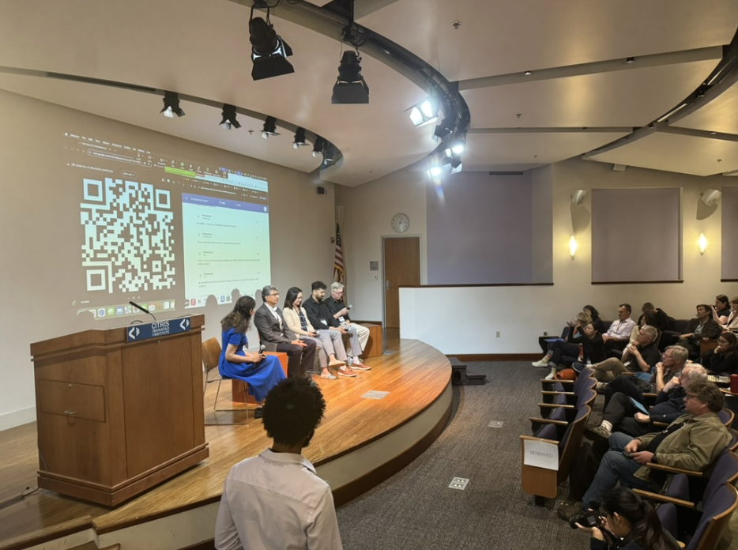
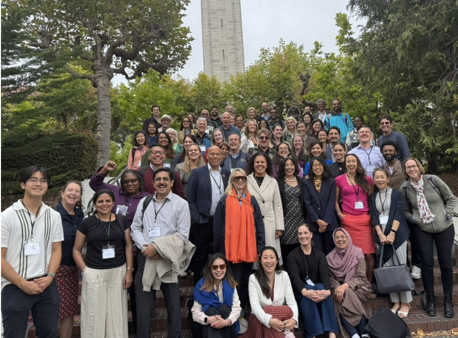

On June 24, the 2025 National Workshop on Data Science Education (NWDSE) devoted a full day to exploring artificial intelligence in the classroom. Organized at UC Berkeley’s Banatao Auditorium, there are five sessions that  brought together educators, researchers, and technology leaders to discuss how AI intersects with teaching, data science, and the future of learning.

## Session 1: Using AI tools in Pedagogy - AI tools for teaching, tutoring and assessment

{fig-align="center" width="80%" alt-alt="The first panel at NWDSE 2025 AI day."}

Speakers: Narges Norouzi (Associate Teaching Professor in the Department of Electrical Engineering and Computer Sciences at UC Berkeley), Vinitra Swamy (CEO and co-founder of Schole.ai), Jenae Cohn (Executive Director of UC Berkeley Center for Teaching and Learning), Zach Pardos (Associate Professor of Education at UC Berkeley)

This opening session focused on classroom applications of AI for teaching and tutoring. Panelists shared perspectives on how these tools can support instruction and students’ learning experiences. Narges Norouzi walked through an opt-in AI bot in CS 61A—a foundational introductory course—that sends the prompt, problem text, and a student’s code to GPT-4 to generate targeted feedback. Students used it widely and finished homework faster. She also demonstrated AI assistant tools in Data 100, an essential upper division data science class. Q&A bot on Ed discussion and Askademia for in-lecture help monitor and respond to students' questions. Jenae Cohn shared California Learning Lab's effort to build a Framework for Valued Learning Outcomes, using surveys to understand student and instructor perspectives on GenAI use in learning. Vinitra Swamy, our Cal alumnus  and co-founder of Scholé.ai, explained how Scholé.ai provides interactive, self-regulated learning experience with a large language model powered by a course knowledge graph to personalize practice beyond class. Zach Pardos focused on assessment, showing how AI-assisted item generation and learner-simulation workflows can save time while keeping instructors in control of quality and alignment. 

## Session 2: CA Learning Lab Grantees in AI

Speakers: Anjana Yatawara (Assistant Professor of Statistics at California State University, Fullerton), Sunny Le (Assistant Professor at California State University, Fullerton), Carl Whithaus (UC Davis), Sesh Murthy (Professor of Writing and Rhetoric at UC San Diego)

This session focused on AI innovation use cases in the classroom. Ko Ohm showed Closing Knowledge Gaps in Math with AI-Powered Personalized Learning, implemented in a precalculus course: mastery-based homework with optional test prep and extra assignments, an AI tutor that fielded 4,000+ student questions, and an optional webcam add-on that reads facial expressions (e.g., confusion, engagement, frustration) to add affective context to support. Anjana Yatawara introduced AI in Math 4200 through an AI-literacy on-ramp and a structured guide grounded in computational thinking and think-aloud protocols, pairing a custom prompt with a custom GPTs assistant that acts like a supportive teaching aide. Sunny Le presented a generative practice-interview trainer that creates authentic, discipline-specific job simulations with real-time feedback and coaching for students. Carl Whithaus shared a peer-and-AI review + reflection approach in writing courses, finding AI feedback valuable but most effective when paired with peer feedback, since peers bring the assignment’s local context and expectations into the revision loop.

## Session 3: Infrastructure and delivery of AI to the classroom

Speakers: Katerina Antypas (Director of the Office of Advanced Cyberinfrastructure, National Science Foundation), Frank Wuerthwien (Director of the San Diego Supercomputer Center), Carl Boettiger (Associate Professor of Environmental Science, Policy and Management at UC Berkeley), Eric Van Dusen (Outreach and Tech Lead; Lecturer of Data Science Undergraduate Studies at UC Berkeley)

This session centered on programs and partnerships that enable classroom AI at scale. Katerina Antypas outlined the NAIRR Pilot’s classroom initiatives: allocating AI resources directly to courses, offering workshops and training with 14 government agencies and 28 industry and non-profit partners, building educator communities, and providing test and trial datasets for instruction. Frank Wuerthwien emphasized that cloud and operations costs must be amortized across large deployments and described a longer-term vision for an open, federated national cyberinfrastructure spanning roughly 4,000 accredited institutions, non-profit research organizations, and national laboratories. Carl Boettiger showed how ESPM 157 (~122 students) uses Jupyter-AI with open LLMs; to keep pace with fast-changing tools, students build RAG/TAG agents and use NRP for collaborative, safe LLM practice. Eric Van Dusen reported that the UC Berkeley Data Science department uses JupyterHub to support the largest major (~1,000 students) and the largest class (~1,500 students). UC Berkeley collaborates with UCSD/SDSC’s NSF CloudBank to support JupyterHub infrastructure for CSUs and California community colleges as part of Cal-ICOR and Cal Learning Lab’s initiatives. UC Berkeley also partners with NRP on a Discovery Hub and course namespaces with GPU access so a small cohort can use substantial compute during class.

## Session 4: AI and ethics in teaching

Speakers: Alex Strang (Assistant Teaching Professor of Statistics at UC Berkeley), Noopur Raval (Assistant professor of Information Studies at UCLA), Hui Yang (Professor of Computer Science at San Francisco State University),Sarah Roberts (Associate professor at UCLA)

The session addressed curricular approaches to ethics in AI. Alex Strang described Data 102’s integration of technical modeling and decision-making with ethics: activities and assignments ask students to contrast group fairness and individual fairness and to work with formal measures and methods. Noopur Raval presented approaches for teaching ethics, context, and responsibility in the era of generative AI, including classroom use of games for relationality and relational ethics, data materialization exercises, and AI forensics. Hui Yang introduced E-GAISE, an ethical-GenAI classroom project inspired by SFU’s graduate certificate in ethical AI, designed to integrate, implement, and evaluate GenAI’s effects on students’ critical thinking. Sarah Roberts outlined the development of DataX as an initiative on data justice and society that builds a structured curriculum for data justice and provides faculty consultation for course integration.

## Session 5: Bridging AI and Humanity: A conversation about Vision and Change

Speakers: Jennifer T. Chayes (Dean of the College of Computing, Data Science, and Society at UC Berkeley), Safiya U. Noble (Professor of Gender Studies at UCLA)
Moderator: Meredith M. Lee (Head of strategic partnerships at CDSS)

The closing session featured Jennifer Chayes and Safiya Noble in a moderated discussion by Meredith Lee. The conversation underscored critical thinking, interdisciplinary education, and the importance of open systems that broaden access to and participation in AI. If you’re interested in this discussion, read the full recap: ["Conversation at UC Berkeley workshop shares perspectives on AI and humanity"](https://cdss.berkeley.edu/news/conversation-uc-berkeley-workshop-shares-perspectives-ai-and-humanity)

{fig-align="center" width="80%" fig-alt="Group Photo of NWDSE attendees"}